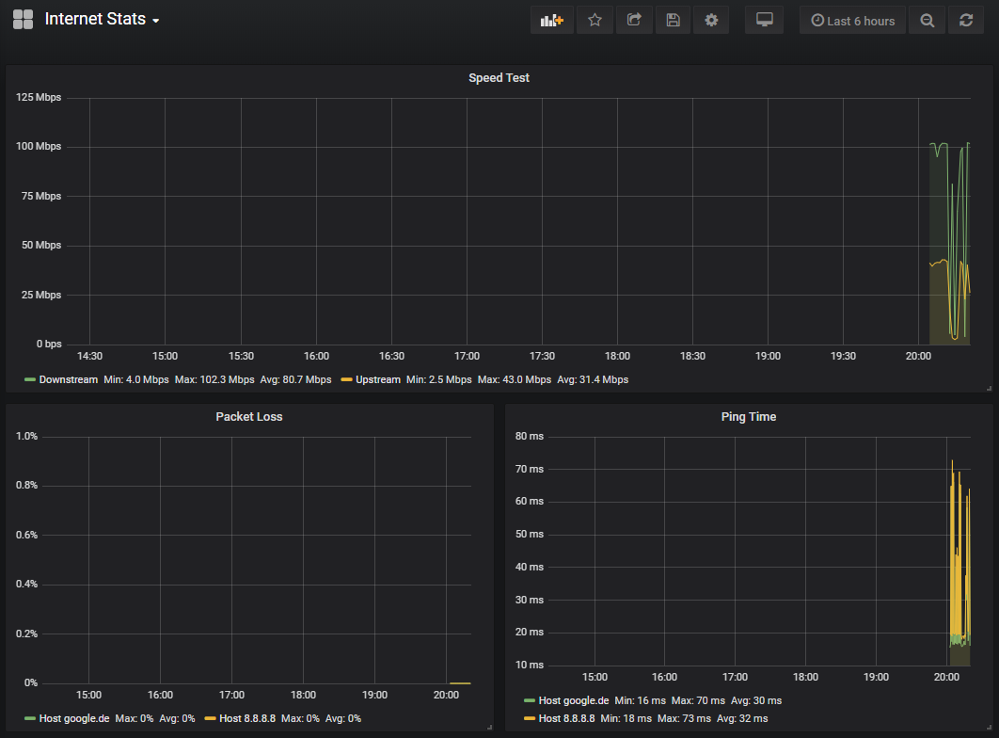

# Blame Your Provider

This is a small stack which collects metrics of your internet. You can yeet
this metrics to your provider, blaming them for not giving you the internet
you deserve.



## Metrics

Currently collected are:

- Ping
- Packet Loss
- Speed Test (every 5 minutes, speedtest.net)

## Usage

1. Be a docker god and know what to do 🙃.
2. Bring up the stack:
   ```
   docker-compose up -d
   ```
3. Open your browser at http://localhost:3000 and login with `admin:admin`.
4. Add an InfluxDB DataSource:
   ```
   URL: http://influxdb:8086
   Database: telegrafdb
   User: telegraf
   Password: superInsecureInfluxPassword
   ```
5. Import a dashboard from JSON, e.g. [the one included here](dashboards/dashboard.json).
6. ... wait for enough data ...
7. Blame your provider!
